[](https://github.com/alejandro-rios/Art-Catalog-App-Android/actions/workflows/run_unit_tests.yml)
[](https://kotlinlang.org)


# Art Catalog App 🎉🎉
Art Catalog App is an app that allows users to navigate the catalog of artworks exposed by the [Art Institute of Chicago API](https://api.artic.edu/docs/#introduction).

The app runs from API 24 and above, just clone the project and run it as you normally run an Android project.

## ⚙️ Architecture
The architecture used for the application consists of the following:

- Clean Architecture.
- Repository pattern.
- MVVM pattern.
- Android Architecture components ([ViewModel](https://developer.android.com/topic/libraries/architecture/viewmodel), [Navigation](https://developer.android.com/guide/navigation), [Room](https://developer.android.com/training/data-storage/room), [Lifecycle](https://developer.android.com/jetpack/androidx/releases/lifecycle))

This project uses basic UiStates(`ArtworkDetailUIState`, `ArtworkFavoritesUIState`, `ArtworksUiState`) to handle the application 
interface state at a given moment.

## 📚 Tech stack
- [Retrofit2](https://square.github.io/retrofit/): Type-safe client for Android and Java/Kotlin, used to make API REST calls.
- [Koin](https://insert-koin.io/): A smart Kotlin injection library.
- [Kotlin Coroutines](https://github.com/Kotlin/kotlinx.coroutines): Simple library used to run Asynchronous or non-blocking calls.
- [Kotlin Serialization](https://github.com/Kotlin/kotlinx.serialization): Simple library used to serialize data.
- [Material components](https://m3.material.io/): Interactive building blocks for creating a user interface and animations between views.
- [Jetpack Compose](https://developer.android.com/jetpack/compose): Recommended modern toolkit for building native UI.
- [Accompanist permissions](https://google.github.io/accompanist/permissions/): A library which provides Android runtime permissions support for Jetpack Compose.
- [ViewModel](https://developer.android.com/topic/libraries/architecture/viewmodel): A business logic or screen level state holder.
- [Room](https://developer.android.com/training/data-storage/room): Room is an abstraction layer on top of a SQLite database.
- [Navigation](https://developer.android.com/guide/navigation): Navigation is a framework for navigating between 'destinations' within an Android application.
- [Lifecycle](https://developer.android.com/jetpack/androidx/releases/lifecycle): Build lifecycle-aware components that can adjust behavior based on the current lifecycle state.
- [Coil](https://coil-kt.github.io/coil/): Image loading for Android and Compose Multiplatform.
- [Mockk](https://mockk.io/): Open source library focused on making mocking test more easily.
- [Kluent](https://markusamshove.github.io/Kluent/): Fluent Assertion-Library for Kotlin.
- [Turbine](https://github.com/cashapp/turbine): A small testing library for kotlinx.coroutines Flow.

## 🧱 Project Structure
```sh
.
├── data
│   ├── db
│   ├── mappers
│   ├── models
│   ├── network
│   ├── repository
│   └── utils
├── di
├── domain
│   ├── models
│   └── repository
├── helpers
└── ui
    ├── components
    ├── navigation
    ├── screens
    ├── theme
    └── utils
```

### Data Package
- `db` all the classes related to local storage with Room.
- `mappers` as the name suggests, this folder contains the required files to pass the info from the API response to the domain models in the project.
- `models` data class files for the API call response.
- `network` representation for the API Network client calls.
- `repository` class implementation for each interface call declared in `Domain package`.
- `utils` contains a Result Wrapper(CallResult), Exception file and extension used to process the Retrofit response.

### Domain Package
- `models` data class files for the API call response as we need it in the app.
- `repository` interface that define the use case to be performed by `Data package`.

### UI Package
- `components` reusable UI components that can be used throughout the application.
- `navigation` holds the navigation logic used on the app.
- `screens` contains files that represents each screen, includes composable function, view model and ui state.
- `theme` contains defined values of `colors`, `shapes`, `typografy` used by the app's theme.
- `utils` contains a Modifier file that has some custom modifiers.
- it also contains the `MainActivity`.

### App Package
- `di` all the classes related to dependency injection(`appModule`, `dataModule`, `domainModule`, `databaseModule`).
- `helpers` contains the `NotificationHelper` which is a class to handle notifications.

## 🧪 Testing
This project includes unit tests for:
  - Extensions
  - Mappers
  - Repository
  - ViewModels

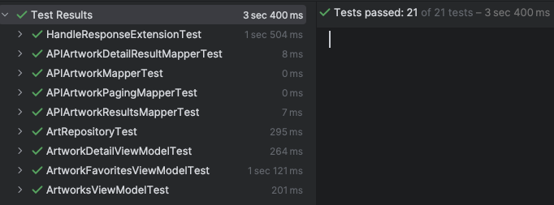

It also includes integration test for Room Database:

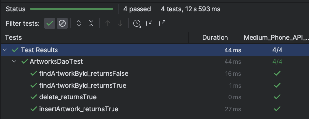

And an integration test for Navigation:

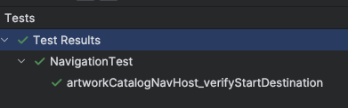

And an ui test for Screens:

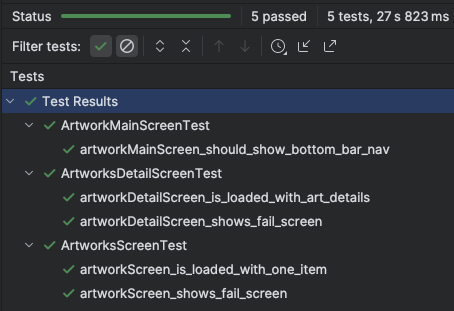

And End to End tests with [Maestro](/maestro_tests)

## 🖼️ Images
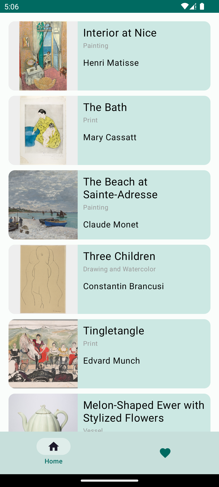
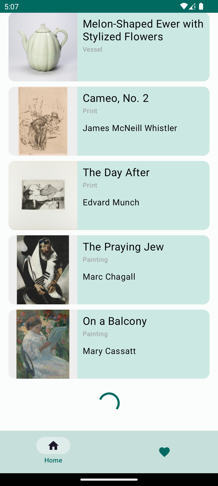
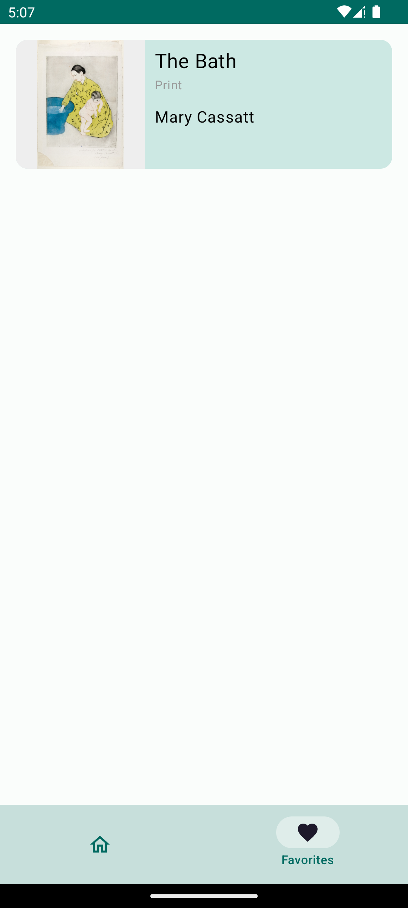
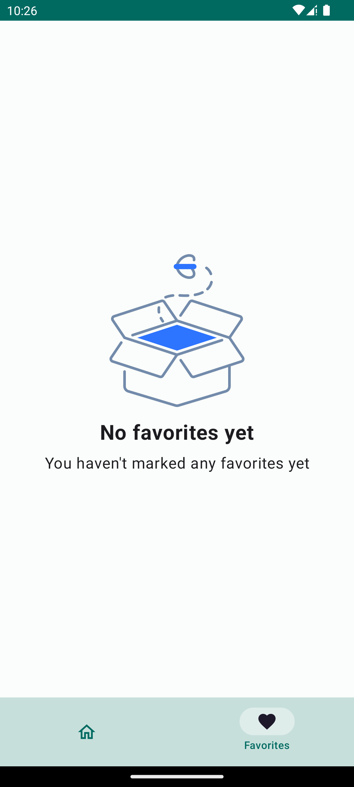
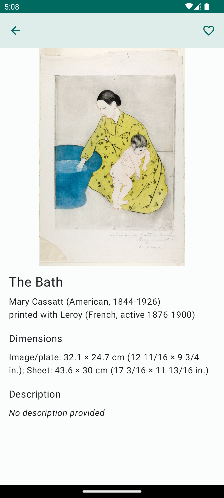

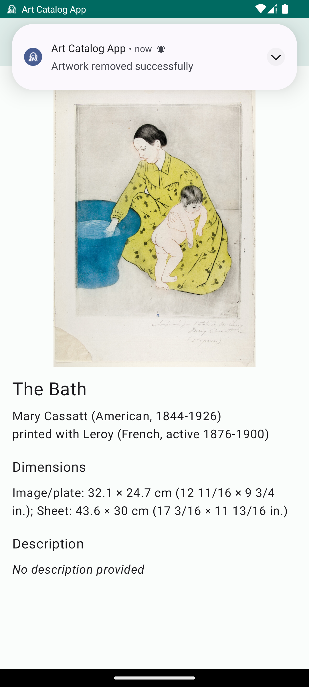
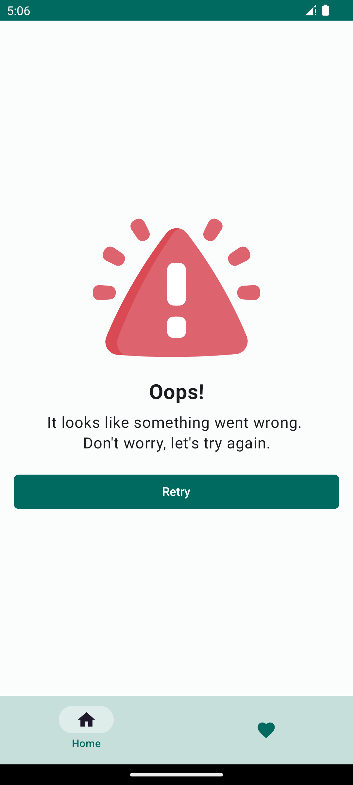


## 📓 Notes and considerations
- Most of the colors where taken from the original website, but I'm not an expert 😅.
- Normally, I use Koin for DI, but I also have experience with hilt.
- warning image taken from [here](https://www.flaticon.com/free-icon/warning_2797387?term=error&page=1&position=5&origin=search&related_id=2797387)
- placeholder image taken from [here](https://www.flaticon.com/free-icon/image_9261484?term=image+placeholder&page=1&position=28&origin=search&related_id=9261484)
- empty_box image taken from [here](https://www.freepik.com/icon/empty-box_7486744)
- logo image taken from [here](https://www.visualpharm.com/free-icons/edvard%20munch-595b40b75ba036ed117d7cf3)
- no_image icon taken from [here](https://www.flaticon.com/free-icon/no-image_11305479)
